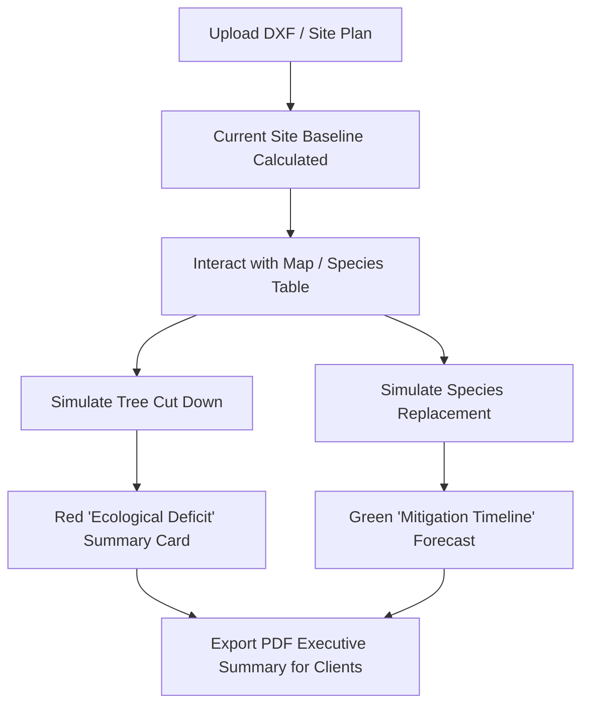

# Eco-Impact Simulator & Deployment Strategy

This document outlines:
1. How to make the tool directly support client negotiations and architect confidence.
2. A step-by-step technical guide to deploy this Streamlit dashboard to `solarpunked.online`.

---

## Part 1: Making the Ecological Goal Feasible in the App

To help clients understand the consequences of tree removal and empower landscape architects to defend their designs, we can implement an interactive **"🪓 Tree Removal & Mitigation Simulator"** directly within the dashboard.

### Proposed Simulator Feature Workflow



### 1. The "What-If" Removal Panel (Client Perspective)
Add a sidebar or drawer control in the dashboard where users can toggle trees "Active" or "Cut Down" (either by clicking individual trees on the Map or selecting a species to cut):
*   **The "Deficit" Ledger:** Display a prominent red card showing the exact loss of values:
    *   *Carbon Released:* Instant release of stored carbon back into the atmosphere (in $\text{CO}_2$ equivalents).
    *   *Runoff Vulnerability:* Instant loss of stormwater canopy interception capacity (in Liters per rain event).
    *   *Pollution Spike:* Increase in local particulate matter (PM2.5) due to lost leaf area.
*   **Interactive Narrative:** "Removing these **15 mature trees** is equivalent to releasing the emissions of **12 average cars** annually and increasing peak stormwater runoff by **35,000 Liters** during heavy tropical rain events."

### 2. The Mitigation & Replacement Panel (Architect Perspective)
When a tree is marked as removed, allow the architect to select a "Replacement Species" (with default starting DBH like 5cm) and calculate:
*   **The Break-Even Timeline:** How many years of growth are required for the new planting to match the ecological benefits of the removed tree? (e.g. *"Your new Angsana saplings will take 12 years to offset the carbon lost from cutting down the mature rain trees."*)
*   **Multi-Benefit ROI:** Prove why a high-density, high-canopy tree is superior. Compare replacing with cheap ornamental plants vs. high-performing shade trees.

---

## Part 2: Deployment Guide for solarpunked.online

Since the engine and dashboard are built using Streamlit, you can deploy the app to your domain `solarpunked.online` using one of three standard methods.

### Option A: PaaS Deployment (Recommended: Render.com or Railway.app)
*Best balance of zero server maintenance, free SSL, and Git-based automated deployments.*

1.  **Prepare the Codebase:**
    Ensure you have `requirements.txt` containing all necessary dependencies:
    ```text
    streamlit
    pandas
    numpy
    plotly
    pydeck
    ezdxf
    ```
2.  **Add a Streamlit Config File:**
    Create `.streamlit/config.toml` to ensure correct port binding:
    ```toml
    [server]
    port = 8080
    enableCORS = false
    enableXsrfProtection = false
    ```
3.  **Deploy to Render/Railway:**
    *   Link your GitHub repository.
    *   Set the Build Command to: `pip install -r requirements.txt`
    *   Set the Start Command to: `streamlit run itree_sea/dashboard.py`
4.  **Configure Custom Domain:**
    *   Go to your Render/Railway dashboard -> Custom Domains.
    *   Add `solarpunked.online` (or a subdomain like `itree.solarpunked.online`).
    *   Go to your DNS provider (e.g., Cloudflare, Namecheap, GoDaddy) and add a **CNAME** record pointing to the address provided by Render/Railway.

---

### Option B: Streamlit Community Cloud (100% Free & Easiest)
*Streamlit hosts the app for free. You simply point your domain name to their servers.*

1.  Push your code to a public GitHub repository.
2.  Log into [share.streamlit.io](https://share.streamlit.io/) using your GitHub account.
3.  Click **Deploy an app**, select your repository, branch, and entry point (`itree_sea/dashboard.py`).
4.  Once deployed, open settings -> **Custom Domain** and enter `solarpunked.online`.
5.  Update your domain's DNS manager with the CNAME record generated by Streamlit.

---

### Option C: VPS / Docker Deployment (For Maximum Performance & Control)
*Deploying to a $5/month DigitalOcean Droplet, Hetzner, or AWS LightSail VPS.*

1.  **Create a Dockerfile:**
    ```dockerfile
    FROM python:3.10-slim
    WORKDIR /app
    COPY requirements.txt .
    RUN pip install --no-cache-dir -r requirements.txt
    COPY . .
    EXPOSE 8501
    CMD ["streamlit", "run", "itree_sea/dashboard.py", "--server.port=8501", "--server.address=0.0.0.0"]
    ```
2.  **Set up Nginx Reverse Proxy with SSL (Let's Encrypt):**
    Install Nginx and Certbot on your VPS:
    ```bash
    sudo apt update && sudo apt install nginx certbot python3-certbot-nginx -y
    ```
3.  **Nginx Server Configuration:**
    Create `/etc/nginx/sites-available/solarpunked` and add:
    ```nginx
    server {
        server_name solarpunked.online;

        location / {
            proxy_pass http://localhost:8501;
            proxy_http_version 1.1;
            proxy_set_header Upgrade $http_upgrade;
            proxy_set_header Connection "upgrade";
            proxy_set_header Host $host;
            proxy_cache_bypass $http_upgrade;
        }
    }
    ```
    Enable the site and obtain SSL certificate:
    ```bash
    sudo ln -s /etc/nginx/sites-available/solarpunked /etc/nginx/sites-enabled/
    sudo systemctl restart nginx
    sudo certbot --nginx -d solarpunked.online
    ```
