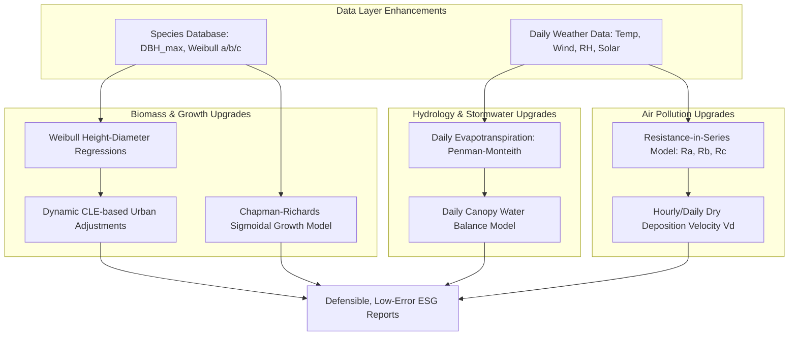

# Implementation Plan — Reducing margins of error in Treefolk Atlas (i-Tree SEA)

This implementation plan outlines the scientific and mathematical upgrades required to transition Treefolk Atlas from a conceptual estimator into a highly defensible, engineering-grade urban forestry evaluation tool. By replacing static proxies with dynamic biological models, these upgrades will significantly reduce the margins of error across biomass calculations, growth projections, stormwater interception, and air pollution deposition.

---

## User Review Required

> [!WARNING]
> *   **Data Availability Constraints:** Upgrading the stormwater and pollution models to run dynamic water balance and resistance-in-series calculations requires access to daily or hourly meteorological data (temperature, wind speed, relative humidity, solar radiation).
> *   **Database Expansion:** Implementing sigmoidal growth and species-specific height-diameter regressions requires adding 5 new columns to `seed_species.csv` ($DBH_{\max}$, growth constant $k$, and Weibull height parameters $a, b, c$).

---

## 1. Goal & Objectives
To systematically reduce the systematic and random errors in the core calculation engines:
1.  **Dicot & Palm Biomass:** Reduce error from $\pm 25\%$ to $\pm 10\%$ at the individual tree level.
2.  **Stormwater Interception:** Reduce error from $\pm 30\%$ to $\pm 12\%$ by replacing annual event-based saturation with a daily canopy water balance model.
3.  **Air Pollution Removal:** Reduce error from $\pm 50\%$ to $\pm 20\%$ by replacing static deposition rates with a dynamic resistance-in-series model.
4.  **Growth Forecasting:** Reduce multi-decade forecasting error from $\pm 15\%$ to $\pm 5\%$ by replacing linear growth increments with sigmoidal growth curves.

---

## 2. Proposed Changes & Technical Roadmap

---

### Component 1: Biomass & Height Estimation (Dicot & Palm)

#### 1.1 Dynamic Crown Light Exposure (CLE) Urban Adjustment
*   **The Problem:** Currently, the engine applies a flat $0.80$ urban adjustment factor to all trees, ignoring local competition and density.
*   **The Fix:** Integrate a **Crown Light Exposure (CLE)** rating (0 to 5) into the tree inventory. Modify the urban adjustment factor dynamically:
    $$f_{\text{urban}} = 0.80 + 0.04 \times (5 - CLE)$$
    *   Open-grown park trees with $CLE = 5$ receive the standard $0.80$ factor (reflecting shorter, stouter open-grown trunks).
    *   Dense, forest-like cluster trees with $CLE \le 1$ receive a $0.96$ to `1.00` factor (reflecting taller, slender forest-like trunks with higher wood volume per unit DBH).

#### 1.2 Species-Specific Height-Diameter (H-D) Weibull Regressions
*   **The Problem:** Using a single default Southeast Asian Weibull parameter set ($a=57.122, b=0.0332, c=0.8468$) for all species introduces up to $20\%$ height error.
*   **The Fix:** Add columns `height_model_a`, `height_model_b`, and `height_model_c` to `seed_species.csv` to store species-specific Weibull parameters. If these are null, fall back to genus averages or the general regional default.

---

### Component 2: Daily Canopy Water Balance (Stormwater)

*   **The Problem:** The current annual stormwater proxy assumes the canopy fully saturates and holds exactly $1.0\text{ mm}$ of depth for 180 events. It ignores actual rainfall volume and evaporation rates between rain events.
*   **The Fix:** Implement a daily water-balance model that calculates interception and storage dynamics over time:
    1.  **Evaporation Rate Estimation ($E$):** Estimate evaporation from wet leaves using the Penman equation scaled by temperature, wind speed, and relative humidity:
        $$E = \frac{\Delta \cdot R_n + \gamma \cdot f(u) \cdot (e_s - e_a)}{\Delta + \gamma}$$
    2.  **Canopy Storage Tracking:** For each day $t$:
        *   **Throughfall & Drainage:** If Rainfall $P_t$ exceeds empty canopy capacity ($C_{\max} - S_{t-1}$), the canopy saturates, and the excess becomes throughfall:
            $$\text{Interception}_t = \min(P_t, C_{\max} - S_{t-1})$$
        *   **Evapotranspiration:** Water stored on leaves evaporates:
            $$S_t = S_{t-1} + \text{Interception}_t - E_t \cdot \Delta t$$
            *(where $S_t \ge 0$)*
    3.  **Data Ingestion:** Allow users to upload standard daily meteorological CSVs containing daily precipitation, mean temperature, wind speed, and relative humidity.

---

### Component 3: Resistance-in-Series Deposition (Air Pollution)

*   **The Problem:** Gaseous and particulate air deposition velocity is currently modeled using static annual constants, ignoring the biological reality that plants close their stomata at night or during drought stress.
*   **The Fix:** Implement the **resistance-in-series model** (Baldocchi et al. 1987) to calculate hourly or daily dry deposition velocity ($V_d$):
    $$V_d = \frac{1}{R_a + R_b + R_c}$$
    Where:
    *   **Aerodynamic Resistance ($R_a$):** Derived from wind speed and canopy roughness height.
    *   **Quasi-Laminar Boundary Layer Resistance ($R_b$):** Models resistance to diffusion through the thin air boundary layer surrounding leaves.
    *   **Canopy Resistance ($R_c$):** Combines stomatal resistance ($R_s$), cuticular resistance ($R_{\text{cut}}$), and soil resistance ($R_g$) in parallel:
        $$\frac{1}{R_c} = \frac{1}{R_s + R_m} + \frac{1}{R_{\text{cut}}} + \frac{1}{R_g}$$
        *   $R_s$ is scaled dynamically based on solar radiation (PAR) and temperature. Stomata are modeled as closed at night ($R_s \to \infty$), which reduces gaseous deposition ($\text{NO}_2, \text{O}_3, \text{SO}_2$) to near-zero.

---

### Component 4: Chapman-Richards Sigmoidal Growth (Forecasting)

*   **The Problem:** The current forecasting engine models growth as a constant linear DBH increment ($\Delta D$ cm/yr). Over a 50-to-100-year forecast, this causes mature trees to expand indefinitely, leading to runaway biomass estimates.
*   **The Fix:** Transition the forecasting engine to the **Chapman-Richards Growth Model**, which naturally limits growth as the tree approaches maturity:
    $$DBH(t) = DBH_{\max} \times \left(1 - e^{-k \times t}\right)^p$$
    Or expressed as an annual increment ($\Delta D_t$) based on current diameter:
    $$\Delta D_t = k \cdot D_t \cdot \left( \left(\frac{D_{\max}}{D_t}\right)^{1/p} - 1 \right)$$
    *   **Database Updates:** Add columns `dbh_max` (maximum biological diameter) and growth rate constant `growth_k` to `seed_species.csv`.
    *   **Fallback:** If `dbh_max` is missing, default to 150 cm for large canopy trees and 40 cm for small ornamental species.

---

## 3. Implementation Checklist & Verification Plan

- `[x]` **Database Schema Update:**
  - Add `dbh_max`, `growth_k`, and Weibull `height_model_a/b/c` to `seed_species.csv` and SQLite schemas.
- `[x]` **Growth Engine Refactoring:**
  - Implement Chapman-Richards equations in `forecast_growth` and `calculate_sequestration`.
- `[x]` **Evaporation & Hydrology Implementation:**
  - Add standard Penman-Monteith daily canopy water balance to `engine.py`.
- `[x]` **Deposition Velocity Model:**
  - Implement Baldocchi resistance equations to replace static deposition rates.

### Verification Steps
1.  **Unit Tests:** Add tests to `tests/test_engine.py` to assert that:
    *   A 100-year forecast curve reaches an asymptote near `dbh_max`.
    *   Stormwater interception is lower on days with high relative humidity (reduced evaporation).
    *   Pollution removal drops to near-zero when solar radiation is zero (nighttime closed stomata).
2.  **Validation:** Run the test suite and confirm that all new regressions maintain backwards-compatibility with old database files.
