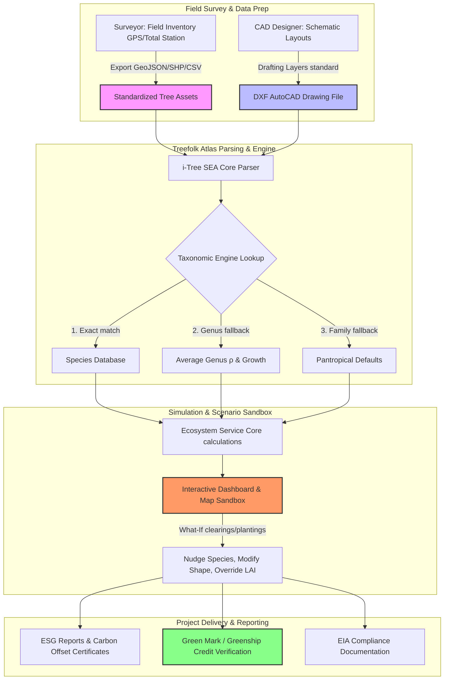

# Scientific Methodology & Workflow Integration Report
## Treefolk Atlas (i-Tree SEA) Adaptations for Tropical Southeast Asia

> **Document Reference:** ATLAS-METHODOLOGY-v0.5  
> **Date:** May 2026  
> **Target Audience:** Landscape Architects, Urban Foresters, Surveyors, and Environmental Consultants  
> **Repository Documentation:** [methodology.md](file:///d:/Leonanda's%20Professional%20Vault/Projects/itree-sea/docs/methodology.md)

---

## 1. Executive Summary

The **Treefolk Atlas (i-Tree SEA)** is a specialized, open-source urban forestry evaluation platform. It adapts and extends the USDA Forest Service i-Tree Eco methodology to suit the unique climatic, taxonomic, and structural conditions of equatorial Southeast Asia (Köppen *Af* and *Am* zones). 

By integrating species-specific wood densities, tropical height-diameter models (Weibull regressions), dedicated monocot (palm) equations, and morphology-driven canopy modifiers, the tool provides landscape architects and surveyors with a highly localized engine to quantify the ecological benefits of urban green infrastructure. It translates physical inventory or CAD/GIS layouts into audited environmental metrics, including carbon storage, gross sequestration, oxygen production, pollution dry-deposition, and stormwater runoff reduction.

---

## 2. Core Scientific Methodology & Mathematical Foundations

Unlike temperate climate engines that rely on simplified hardwood/conifer categorizations, Treefolk Atlas utilizes localized parameters and biological formulas.

### 2.1 Aboveground Biomass (AGB) Calculations

#### For Dicotyledonous Trees (Standard Broadleaf & Needle Species)
The engine implements the pantropical allometric model by **Chave et al. (2014)** as the baseline for aboveground biomass:

$$\text{AGB}_{\text{base}} = 0.0673 \times (\rho \times D^2 \times H)^{0.976}$$

Where:
*   $\text{AGB}_{\text{base}}$ is the dry-weight aboveground biomass (kg).
*   $\rho$ is the species-specific basic wood specific gravity (g/cm³), sourced from the **Global Wood Density Database (Chave 2009, Zanne 2009)**.
*   $D$ is the Diameter at Breast Height (DBH, cm) measured at 1.3 m above ground.
*   $H$ is the total height of the tree (m).

To account for architectural differences in urban open-grown trees, the engine splits biomass into woody and foliage components:

1.  **Woody Component Extraction:**
    $$\text{Woody}_{\text{base}} = \text{AGB}_{\text{base}} \times (1 - \text{DEFAULT\_FOLIAGE\_FRACTION})$$
    *(where $\text{DEFAULT\_FOLIAGE\_FRACTION} = 0.05$ or $5\%$)*

2.  **Morphological Corrections for Structure:**
    $$\text{Woody}_{\text{adjusted}} = \text{Woody}_{\text{base}} \times f_{\text{trunk}} \times f_{\text{crown}}$$
    *   **Trunk Taper Multiplier ($f_{\text{trunk}}$):** Standard single-stem taper (`1.0`), Buttressed base (e.g., *Ficus*, *Samanea* = `1.15`), and Multi-stemmed structure (e.g., *Dypsis lutescens* cluster = `0.85`).
    *   **Crown Shape Multiplier ($f_{\text{crown}}$):** Columnar (`0.80`), Conical (`0.90`), Spherical (`1.00`), Spreading (`1.15`).

3.  **Foliage Component Calculation:**
    Instead of calculating foliage as a static fraction, the engine models foliage biomass dynamically from leaf geometry and density:
    $$\text{Foliage} = \text{Crown Area} \times \text{LAI}_{\text{species}} \times \text{SLW}$$
    *   **Crown Area (m²):** Derived from Crown Width ($CW$), where $CW = 0.6 + (k_{cw} \times DBH)$ capped at 20 m.
    *   **Crown Modifier ($k_{cw}$):** Specific canopy architectural factors (Columnar/Fastigiate = `0.08`, Standard/Oval = `0.15`, Spreading/Umbrella = `0.25 - 0.30`).
    *   **Leaf Area Index ($\text{LAI}_{\text{species}}$):** Species-specific foliage density multiplier (default = `5.0`).
    *   **Specific Leaf Weight (SLW, kg/m²):** Scaled by leaf morphology class (Simple leaves = `0.12`, Compound leaves = `0.09`, Needles = `0.22`, Palm Fans = `0.32`).

$$\text{AGB}_{\text{final}} = \text{Woody}_{\text{adjusted}} + \text{Foliage}$$

#### For Monocotyledonous Trees (Palms)
Standard dicot allometric models overestimate palm biomass due to distinct structural mechanics (non-tapering cylindrical trunks, absence of secondary lateral cambial growth, and high water-to-dry-mass ratios). Treefolk Atlas applies a dedicated **Cylindrical Stem Model**:

$$\text{AGB}_{\text{palm}} = 0.07854 \times \rho \times D^2 \times H$$

*   *Derivation:* The volume of a cylinder is $V = \frac{\pi}{4} \times (\frac{D}{100})^2 \times H = \frac{\pi}{40000} \times D^2 \times H$ (m³). Converting volume to dry mass using dry wood specific density ($\rho \times 1000$ kg/m³) yields:
    $$\text{AGB}_{\text{palm}} = \left(\frac{\pi}{40000} \times 1000\right) \times \rho \times D^2 \times H \approx 0.07854 \times \rho \times D^2 \times H$$
*   *Taxonomic Calibration:* Basic carbon fraction is adjusted downward to **0.41** (compared to 0.50 for dicots) to reflect the lower lignin content of monocot vascular bundles (IPCC 2006).

---

### 2.2 Hydrological Stormwater Proxy with Saturation Caps

Temperate models typically run continuous water balances that require complex, long-term meteorological datasets. Treefolk Atlas provides two assessment pathways:

#### 1. Annual Stormwater Proxy
Calculates annual canopy precipitation holding capacity based on average local rainfall cycles:

$$\text{Annual Interception (L)} = \text{Crown Area} \times \text{LAI}_{\text{resolved}} \times S_L \times N_{\text{events}} \times 1000$$

*   **Specific Leaf Storage Capacity ($S_L$):** Set to $0.0002\text{ m}$ ($0.2\text{ mm}$ water layer thickness), aligned with i-Tree Hydro (Wang et al. 2008).
*   **Average Annual Rain Events ($N_{\text{events}}$):** 180 distinct events per year (calibrated for Singapore/Jakarta monsoonal patterns).
*   **Canopy Saturation Cap:** For a tree with an LAI of $5.0$, the canopy's absolute retention capacity is $1.0\text{ mm}$ of depth ($5.0 \times 0.2\text{ mm}$). Because tropical downpours almost always exceed this $1.0\text{ mm}$ threshold, the proxy assumes the canopy fully saturates and intercepts exactly this capacity during each of the 180 events. Rain falling beyond this threshold becomes throughfall.

#### 2. Hourly Rainfall Analysis (Advanced Mode)
Users can upload hourly rainfall data (8,760 hours/year). The engine:
*   Groups contiguous wet hours separated by $\ge 6$ dry hours into discrete rain events (WMO standard).
*   For each event, tracks cumulative rainfall. If cumulative rainfall is less than the canopy storage capacity ($\text{Crown Area} \times \text{LAI} \times S_L$), the entire amount is intercepted. If it exceeds it, interception is capped at capacity, and the remainder is categorized as run-off/throughfall.

---

### 2.3 Air Pollution Removal

Dry deposition of particulate and gaseous air pollutants ($\text{PM}_{2.5}$, $\text{NO}_2$, $\text{O}_3$, $\text{SO}_2$) is modeled using annual deposition rates scaled by leaf area and local pollution multipliers:

$$\text{Removal (g/yr)} = (\text{Crown Area} \times \text{LAI}) \times \text{Base Rate} \times \text{Pollution Multiplier}$$

*   **Base Deposition Rates:** $\text{PM}_{2.5} = 0.50$, $\text{NO}_2 = 0.90$, $\text{O}_3 = 1.40$, $\text{SO}_2 = 0.35$ g/m²/yr (Nowak 2006, Chen 2017).
*   **Pollution Multiplier:** Determined by selected **Site Profiles** (Urban Dense = `1.50`, Industrial = `2.00`, Urban Park = `1.00`, Suburban = `0.75`, Coastal = `0.60`, Rural = `0.40`). Advanced mode calculates a weighted multiplier directly from measured concentrations ($\mu\text{g/m}^3$) relative to WHO baseline limits.

---

## 3. Workflow Integration for Landscape Architects & Surveyors

The Treefolk Atlas bridges the gap between field data collection, schematic landscape design, and environmental impact reporting.

### 3.1 For Surveyors (Existing Canopy Asset Auditing)
1.  **Field Inventory Collection:** Surveyors record GPS coordinates, species names (scientific or common), DBH (cm), and tree condition (Excellent to Dead).
2.  **Height-Diameter (H-D) Optimization:** In tropical surveys, measuring the height of every tree is time-consuming and often obstructed by dense multi-tiered canopies. The surveyor only needs to capture DBH. The engine automatically runs the **Feldpausch et al. (2012) 3-parameter Weibull model** to project the asymptotic height curve:
    $$H = a \times (1 - e^{-b \times D^c})$$
    *(using regional Southeast Asian parameters: $a=57.122, b=0.0332, c=0.8468$ unless species overrides exist)*
3.  **GIS Pipeline Upload:** Surveyors export inventories directly as GeoJSON or Shapefiles and run them through the CLI. The engine automatically resolves taxonomic wood densities and computes current environmental baselines.

### 3.2 For Landscape Architects (Schematic Design & Proposed Planning)
1.  **Standardized CAD Layering:** Landscape architects draft planting layouts using standardized layer conventions in AutoCAD/Vectorworks:
    *   `L-PLNT-TREE-PROP` (Proposed new trees)
    *   `L-PLNT-TREE-EXST` (Existing trees to be retained)
    *   `L-PLNT-TREE-RMVL` (Trees targeted for removal/clearing)
2.  **DXF Direct Parsing:** The architect uploads the `.dxf` file directly. The platform reads coordinate blocks, counts symbols, matches block attributes to database species, and resolves planting densities.
3.  **Interactive Scenario Planning (Sandbox):** In the dashboard's manual planting sandbox, the designer can:
    *   **Test Species Alternatives:** Swap a slow-growing hardwood like *Fagraea fragrans* (Tembusu, $\rho=0.82$, $\Delta D=0.5\text{ cm/yr}$) with a fast-growing carbon sink like *Samanea saman* (Rain Tree, $\rho=0.45$, $\Delta D=1.75\text{ cm/yr}$) to optimize carbon capture targets.
    *   **Simulate Canopy Spacing:** Adjust the crown modifier $k_{cw}$ (e.g., set to Columnar `0.08` for tight alignments or Spreading `0.28` for shade canopies) to evaluate the spatial layout and check for crown overlaps.
    *   **Assess Impact of Clearances:** View the immediate loss in stormwater retention and air filtration if mature trees in `L-PLNT-TREE-RMVL` are cut down.

---

## 4. Scientific Accuracy, Error Margins & Calibration

To ensure engineering-grade data, the platform uses peer-reviewed tropical forestry regressions rather than temperate equivalents.

| Calculation Component | Scientific Baseline Model | Expected Error Margin | Calibration Factors & Constraints |
| :--- | :--- | :--- | :--- |
| **Dicot Biomass (AGB)** | Chave et al. (2014) Pantropical Regressions | $\pm 5\% - 10\%$ (Stand level) $\pm 20\% - 25\%$ (Single tree) | Directly incorporates species basic wood density ($\rho$) and height. Adjusts for urban open-grown forms using Nowak's 0.80 canopy reduction factor. |
| **Palm Biomass (AGB)** | Frangi & Lugo (1985); Goodman et al. (2013) Cylindrical | $\pm 10\% - 15\%$ | Employs dedicated cylindrical volume formula ($0.07854 \times \rho \times D^2 \times H$). Eliminates the $200\% - 300\%$ overestimation errors caused by applying dicot models to palms. |
| **Stormwater Interception** | Wang et al. (2008); Hirabayashi (2013) | $\pm 15\% - 20\%$ (Hourly mode) $\pm 30\%$ (Annual proxy) | Constrained by leaf area index (LAI) saturation caps. Represents a relative comparative rank of runoff reduction capacity. |
| **Air Pollution Removal** | Nowak et al. (2006); Chen et al. (2017) | $\pm 40\% - 50\%$ (Order of Magnitude) | Dependent on ambient pollution levels. Excellent for relative comparisons of species layouts, but should not be used as an absolute atmospheric dispersion model. |
| **Growth Forecast** | Observed Database Rates (NParks Singapore) | $\pm 10\% - 15\%$ (Under 20 years) | Incorporates continuous annual increments ($\Delta D$ and palm height growth) from regional urban datasets rather than static category assignments. |

---

## 5. Feature Comparison: i-Tree Eco vs. Treefolk Atlas (i-Tree SEA)

| Evaluation Parameter | Standard USDA i-Tree Eco v6 | Treefolk Atlas (i-Tree SEA) | Local Impact & Rationale |
| :--- | :--- | :--- | :--- |
| **Climatic Baseline** | Temperate Northern Hemisphere (US/Europe) | Tropical Lowland Southeast Asia (Af/Am zones) | Eliminates temperature-based growth limits and frost adjustments that do not apply to tropical regions. |
| **Growth Forecasting** | US Forest Service growth tables or user-supplied overrides | Continuous tropical species growth database | Avoids underestimating growth rates; tropical trees grow 2–4× faster than temperate counterparts. |
| **Palm (Monocot) Modeling** | Standard dicot allometric equations (severe overestimation) | Dedicated Cylindrical Stem volume model | Accurately calculates palm biomass; critical for tropical urban sites where palms make up 20%–40% of plantings. |
| **Wood Density Mapping** | Post-hoc WD ratio weight adjustment | Direct inclusion of $\rho$ in biomass equations | Ensures taxonomic accuracy by utilizing species-level basic specific gravities from local databases. |
| **Tree Height Input** | Mandatory field measurement | Weibull H-D projection (Feldpausch 2012) | Speeds up field surveys; height is projected using regional tropical parameters when omitted. |
| **CAD/GIS Design Integration** | Not supported (requires manual Excel/CSV imports) | Native DXF parsing and shapefile georeferencing | Connects directly to the tools used by landscape architects and surveyors (AutoCAD, QGIS, ArcGIS). |
| **Stormwater Method** | Hourly water balance (requires gauge station data) | Annual proxy + event-based hourly saturation cap | Simplifies calculations for urban planners who lack direct access to meteorological station files. |
| **Evaluation Stage** | Post-facto forest management & inventory | Concept planning, schematic design, and impact modeling | Enables architects to optimize designs *before* construction begins. |

---

## 6. Primary Use Cases & Application Areas

### 6.1 Green Building Certifications (BCA Green Mark, Greenship)
Under green building rating frameworks (such as Singapore's **BCA Green Mark 2021** under the *Health and Well-being (Hw)* section, or Indonesia's **GBCI Greenship** under the *Appropriate Site Development (ASD)* section), projects receive credits for preserving existing mature trees and expanding canopy coverage. 
*   **Application:** Designers generate reports showing the total carbon stored and annual stormwater intercepted by the site. The tool's output serves as audit-ready compliance documentation to secure credits for biophilic design and urban greenery.

### 6.2 ESG Corporate Reporting & Carbon Offsetting
Organizations must demonstrate tangible carbon reduction strategies to meet Environmental, Social, and Governance (ESG) criteria.
*   **Application:** Real estate developers model the long-term (e.g., 30-year) carbon storage and sequestration potential of their developments. The generated PDF outputs provide verifiable data on the lifetime carbon offset of the site, translating ecological benefits into equivalents like gasoline saved or kilometers driven.

### 6.3 Environmental Impact Assessments (EIA) & Tree Preservation Orders (TPO)
Municipal authorities often enforce strict tree preservation guidelines. Developers must justify the removal of mature trees and outline mitigation plans.
*   **Application:** Surveyors map existing trees on layer `L-PLNT-TREE-RMVL`. The engine quantifies the lost ecological value. The landscape architect can then design a compensatory planting plan on layer `L-PLNT-TREE-PROP` and demonstrate that the proposed canopy will reach ecological parity with the cleared vegetation within a specific timeframe.

### 6.4 Urban Hydrology & Sustainable Drainage Systems (SuDS)
Rapid urbanization in Southeast Asia increases the risk of flash flooding.
*   **Application:** Civil engineers and landscape architects use the stormwater interception sandbox to evaluate species layouts. They can compare a columnar layout (such as *Polyalthia longifolia*, $k_{cw}=0.08$) with a wide, spreading canopy layout (such as *Samanea saman*, $k_{cw}=0.28$) to maximize rainfall interception, which helps reduce peak stormwater runoff in flood-prone developments.
